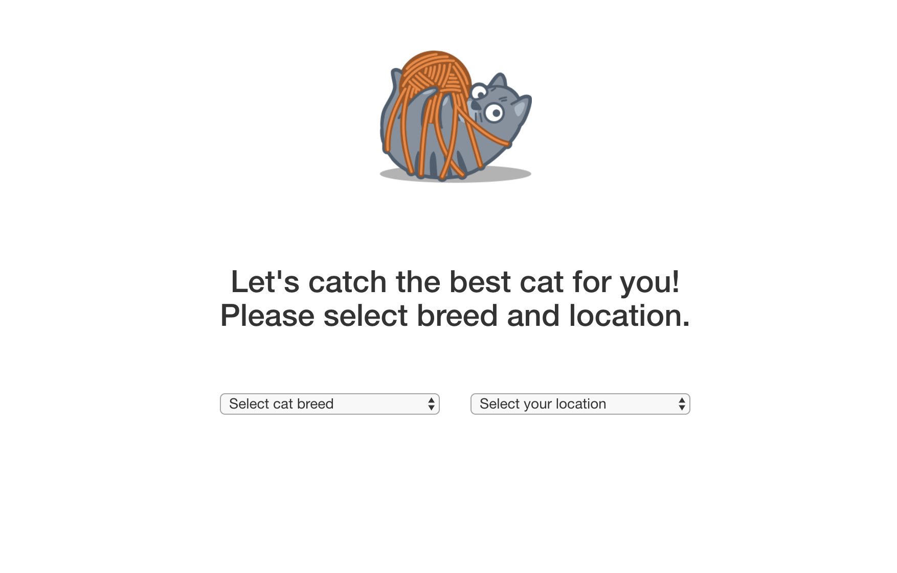
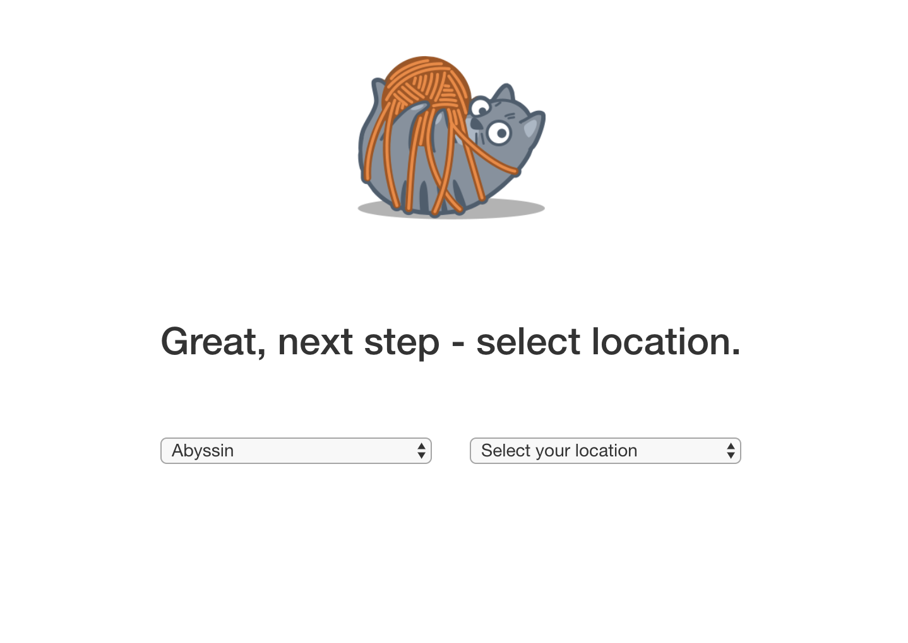
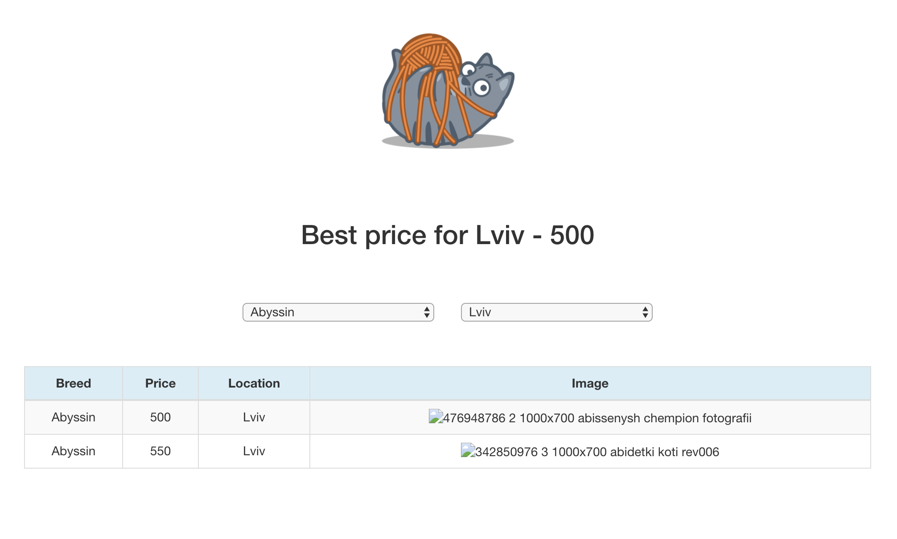

# Cats Dealer
Welcome! Here you can catch a cat for you! Let's go!
### Step 1:

### Step 2:

### Result:

## Solutions that I made:
- The names of essences were changed — they have to be maximum similar with the business views.
- I switched to SLIM and deleted useless things — I prefer clean code 😉
- After cleaning we can proceed to impovements. In general, customers like to have nice UI, so let's start.
- Our customer said: "App looks good, but why we do have so small results?". We need to add more stores, but also we have to extract a logic from controller and cover it with tests, because it will  be inconvenient to extend this logic.
- Finally we can expand our functionality.
- Congrats! Our service is improved. But since we are amazing developers, let’s make the app faster and more resistant to loading.

## How to run Cats Dealer:
- Download the application
- Setup gems and database
- Run seeds
- Run Sidekiq
- Enjoy

## Customer's Idea:
You are going to create simple service that allows finding the best pussycat - best price for customer location.

The are pussycat shops that have pricelists accessible via REST API. What your service will do is just get prices from each shop, compare them and suggest the best deal for a customer!

We created 2 fake test shops for you.
One - "Cats Unlimited" - can be accessed by this URL: 

https://nh7b1g9g23.execute-api.us-west-2.amazonaws.com/dev/cats/json

It returns JSON data.

Another - "Happy Cats" - one is here:

https://nh7b1g9g23.execute-api.us-west-2.amazonaws.com/dev/cats/xml

and returns XML

You may notice that both URLs point the same server, but in this task, please, consider them as absolutely different.

To help you understand the task, we asked our Trainee Ruby developer to create an MVP of "cats-dealer" - the project you have!

There is only one integration - with "JSON" pussycat shop.
Please run the project, see how it works, and explore the code.

You know, Trainee not always writes a good code. You probably agree if I say that the code is terrible! You definitely can do it better!

### So the task is:
#### 1. Refactor or rewrite the existing code. We wanna see a clean OO design, readable code, good test coverage.
#### 2. Implement "XML" integration, and improve business logic to find the best deal amongst two shops.

## Be strong and good luck!
